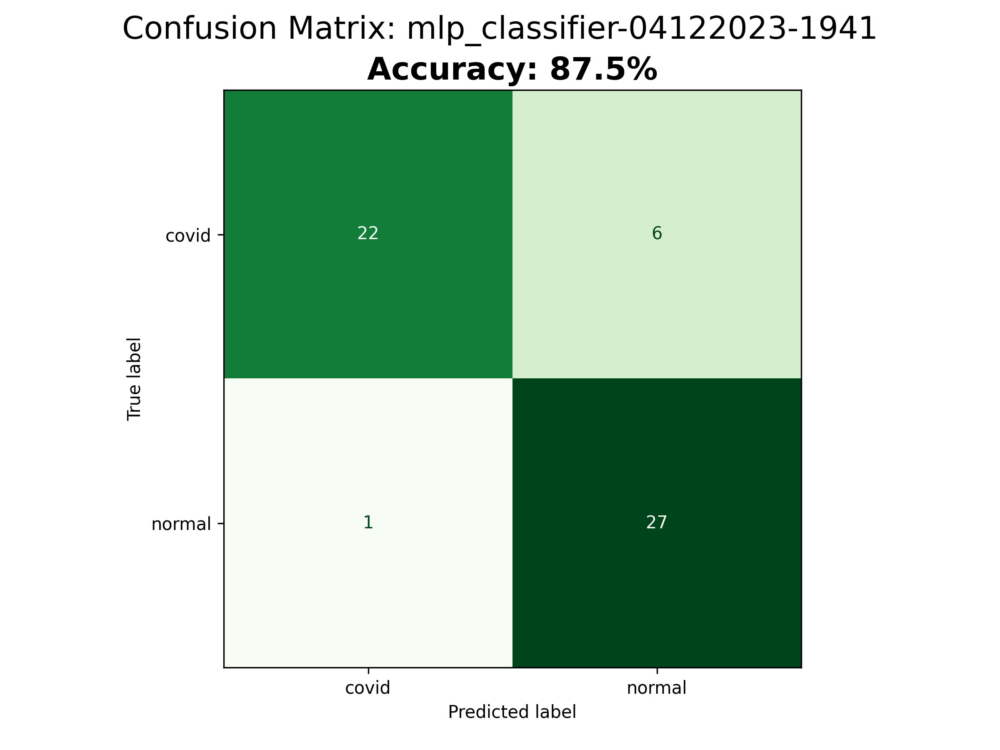
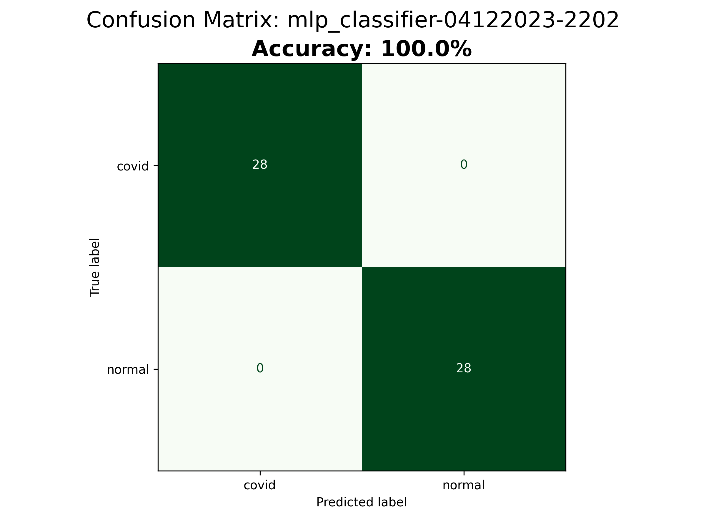
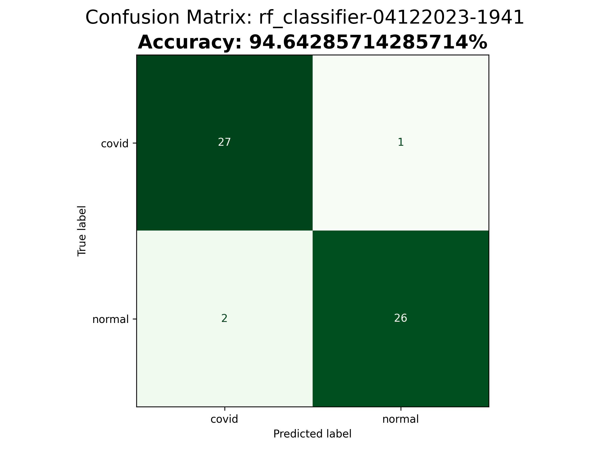
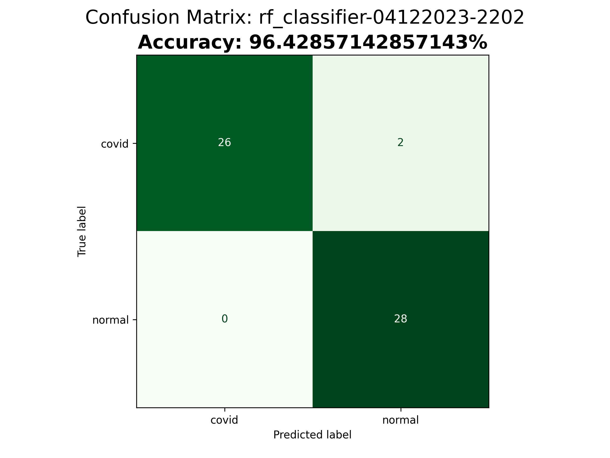
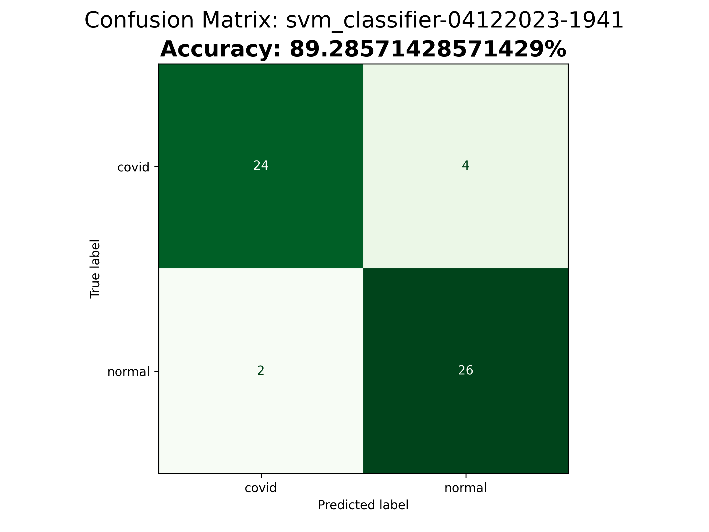
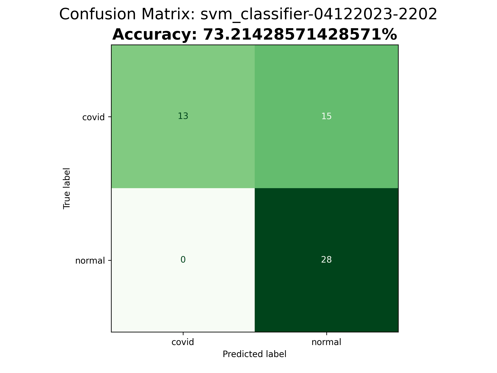
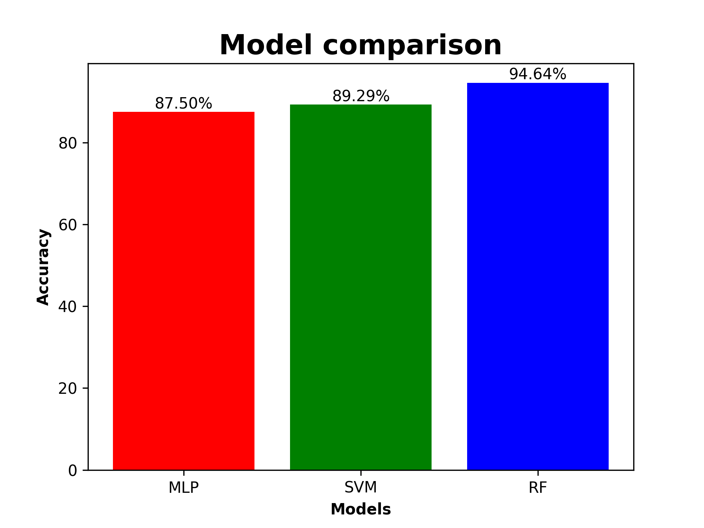
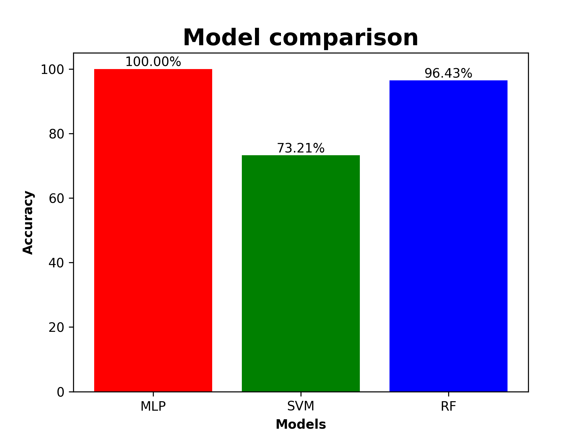

# Local Binary Patterns descriptor with Support Vector Machine, Random Forest and Multi-layer Perceptron classifiers to predict COVID-19 in x-ray pictures

## Equipe

- João Gabriel Eler Mendes
- Giulia de Paula Melão
- Cristiane Fujihara Costa

## Descritor Implementado

O descritor LBP (Local Binary Pattern) é uma técnica popular de extração de características em visão computacional e análise de imagens. Desenvolvido para representar texturas em imagens, o LBP é particularmente eficaz em aplicações como reconhecimento facial, detecção de texturas e classificação de imagens.
A ideia fundamental por trás do LBP é capturar informações locais sobre a textura de uma imagem. Ele opera em nível de pixel, comparando o valor do pixel central com os valores dos pixels vizinhos ao redor. Para cada vizinho, o LBP atribui um bit (1 ou 0) dependendo se o valor do pixel é maior ou menor que o valor do pixel central. Isso gera um padrão binário local para cada região da imagem.
Esses padrões binários locais são então convertidos para uma representação decimal, criando um histograma de frequência. O histograma resultante é um vetor de características que descreve a distribuição dos padrões binários locais na imagem. Essa representação compacta é invariante a mudanças globais de iluminação e é robusta para variações locais na textura.
O LBP é conhecido por sua simplicidade, eficiência computacional e capacidade de capturar informações discriminativas sobre texturas. Ele tem sido amplamente utilizado em diversas aplicações, incluindo reconhecimento de objetos, segmentação de imagens e análise de texturas em imagens médicas. Devido à sua natureza robusta e eficácia em diferentes cenários, o descritor LBP continua sendo uma escolha valiosa na área de processamento de imagens e visão computacional.

## Repositório do Projeto
[LBP descriptor with SVM, RF and MLP classifiers](https://github.com/inteiros/LBP_ML)

## Classificadores e Acurácia

### Multi-layer Perceptron

#### MLP Classifier Confusion Matrix com feature extraction do Gray Histogram



#### MLP Classifier Confusion Matrix com Descritor LBP 



### Random Forest

#### Random Forest Confusion Matrix com feature extraction do Gray Histogram



#### Random Forest Confusion Matrix com Descritor LBP 



### Support Vector Machine

#### Support Vector Machine Confusion Matrix com feature extraction do Gray Histogram



#### Support Vector Machine Confusion Matrix com Descritor LBP 



### Acurácia dos modelos

#### Acurácia dos modelos com feature extraction do Gray Histogram



#### Acurácia dos modelos com Descritor LBP 



## Setup

Para o funcionamento deste projeto é necessario possuir [Python 3.10+](https://www.python.org/) instalado na sua maquina

Com isso em mente, primeiro instale as dependencias necessárias

```sh
pip install scikit-image
pip install sklearn
pip install Bar
pip install split-folders
pip install matplotlib
pip install opencv-python
```

então baixe o [dataset](https://www.kaggle.com/datasets/tarandeep97/covid19-normal-posteroanteriorpa-xrays) e extraia as pastas normal e covid em "images_full"

após a extração das imagens, abra o terminal no repositório e realize o data splitting em train e test com o comando

```sh
python data_splitting.py
```

feito isso, execute o descritor LBP para extração das features e labels (ou Gray Histogram Feature Extraction executando o arquivo grayHistogram_FeatureExtraction.py)

```sh
python localBinaryPattern_textureDescriptor.py
```

e com isso, podemos executar qualquer um dos classifiers para nosso dataset, individualmente ou simplesmente usar o seguinte comando para a execução de todos

```sh
python run_all_classifiers.py
```

após a execução os resultados estarão disponíveis na pasta results.

## Video Presentation

[](https://www.youtube.com/embed/Sj1oEFvnbV8)